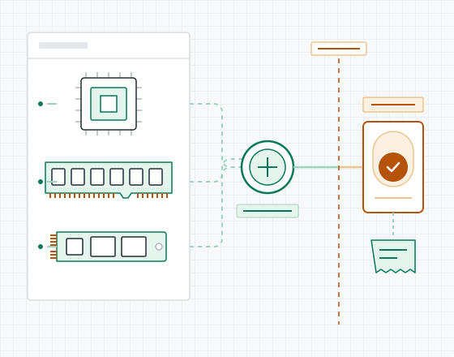

# AutoShop

**A synthetic marketplace where agents can act, but humans define and cross the authority boundaries.**

[Live buyer demo](https://autoshop-webmcp.netlify.app/buyer) · [Seller portal](https://autoshop-webmcp.netlify.app/seller)



AutoShop is a working WebMCP demonstration for delegated commerce. A buyer can let an agent browse computer parts and, in **Auto** mode, change a cart. The buyer must still visibly confirm the exact cart before `submit_order` can succeed. A signed-in seller gives the agent a numerical mandate; in-mandate orders commit atomically, while exceptions require a visible, action-specific human approval before `commit_action` can succeed.

The catalogue, identities, orders, inventory changes, and receipts are synthetic. No payment or shipment occurs.

## Why WebMCP is load-bearing

The same pages serve humans and expose seven role-scoped tools through `document.modelContext.registerTool`. The agent does not scrape buttons or call a separate automation API. Tool availability follows the visible page and seller session, inputs are strict JSON Schemas, every server mutation revalidates live state, and receipts make successful commits inspectable by both roles.

| Portal | Tool | Contract and boundary |
|---|---|---|
| Buyer | `browse_products` | Optional `query` and `limit`; read-only bounded catalogue results. |
| Buyer | `manage_cart` | `action`, `product_id`, `quantity`; agent calls are blocked unless the buyer visibly selects Auto. |
| Buyer | `submit_order` | `order_id`; succeeds only when the page holds an unexpired one-time authorization for that exact confirmed cart. The token is never a tool argument. |
| Seller | `get_mandate` | No input; reads the live numerical policy. |
| Seller | `list_orders` | Optional `limit`; marks buyer-authored content as untrusted. |
| Seller | `accept_order` | `order_id`, `quantity`, `idempotency_key`; commits inside the mandate or returns `APPROVAL_REQUIRED`. |
| Seller | `commit_action` | `action_id`, `idempotency_key`; succeeds only after the seller visibly approves that exact pending action. The token is never a tool argument. |

Seller tools register only after authentication and are removed on logout, expiry, or navigation away from `/seller`.

## Three-minute judge path

Use ChatGPT's in-app Browser or a WebMCP-enabled Chrome build. Start from the [buyer portal](https://autoshop-webmcp.netlify.app/buyer), not the informational homepage.

1. Verify that only the three buyer tools are available. Ask the agent to find DDR memory.
2. Select **Auto**, then ask the agent to add six units of the 16 GB DDR5 RAM. In Ask mode, the same agent mutation is refused.
3. Enter clearly synthetic buyer details and visibly confirm the exact cart. Ask the agent to call `submit_order` with the displayed order ID.
4. Open the [seller portal](https://autoshop-webmcp.netlify.app/seller) and sign in with the private judging credential. Verify that exactly four seller tools appear.
5. Ask the agent to list orders and accept six units with a fresh idempotency key. The default mandate allows five, so the tool returns `APPROVAL_REQUIRED` without changing stock.
6. Review that pending action in the page and check the explicit approval box. Ask the agent to call `commit_action` with the displayed action ID and a fresh idempotency key.
7. Return to the buyer portal: the accepted status and receipt survive refresh. The seller can reset all synthetic state for the next run.

## Safety properties

- Buyer and seller state use separate secure, HttpOnly, SameSite cookies.
- Seller passwords are stored only as scrypt hashes; login is rate-limited and timing-safe.
- One-time authorization tokens are random, hashed at rest, exact-action bound, expiring, and absent from WebMCP schemas.
- Inventory mutation and receipt creation share one database transaction; idempotency keys make retries deterministic.
- Product lookup and mandate checks are server-side; DOM text and buyer-authored fields do not grant authority.
- CSP, HSTS, frame blocking, MIME sniffing protection, and restrictive browser permissions ship in `netlify.toml`.

## Run locally

Requirements: Node.js 22.12 or newer and the Netlify CLI.

```bash
npm ci
npm test
```

`npm start` serves a static UI preview at `http://localhost:3000`; Netlify Functions and database flows are intentionally unavailable there.

For the full stack, create or link a Netlify site with Netlify Database, then set `SELLER_PASSWORD_HASH` to a scrypt hash. Generate a development hash without storing the plaintext:

```bash
node -e "import('./netlify/functions/seller-auth.mjs').then(async m => console.log(await m.createPasswordHash(process.argv[1])))" "choose-a-local-password"
npx netlify env:set SELLER_PASSWORD_HASH "paste-the-generated-hash"
npx netlify database migrations apply
npx netlify dev --no-open
```

Do not commit `.env`, credentials, cookies, tokens, or production database values. See `.env.example` for the only application-owned environment variable.

## Architecture

```text
ChatGPT in-app Browser / WebMCP Chrome
                  │ document.modelContext
        ┌─────────┴─────────┐
     /buyer              /seller
  3 scoped tools      authenticated 4 tools
        └─────────┬─────────┘
             Netlify Functions
        validation · auth · policy
                  │
       Netlify Database (Postgres)
 orders · inventory · approvals · receipts
```

The UI is framework-free HTML, CSS, and JavaScript. Server logic is implemented as Netlify Functions backed by ordered SQL migrations. Tests use Node's built-in test runner and in-memory repositories to exercise contracts, authorization, rollback, idempotency, and lifecycle behavior.

## Deliberate limits

AutoShop is a focused authority demonstration, not a complete commerce platform. It has one seeded seller and catalogue, no payments, fulfilment, tax, analytics, product editing, or multi-store administration. Those conventional seller features would add surface area without strengthening the demonstrated WebMCP boundary.

All SVG artwork in `public/img` is project-created and stored in this repository; the app loads no third-party fonts, scripts, trackers, or image assets.

## License

[MIT](LICENSE) © 2026 rookieCoders
